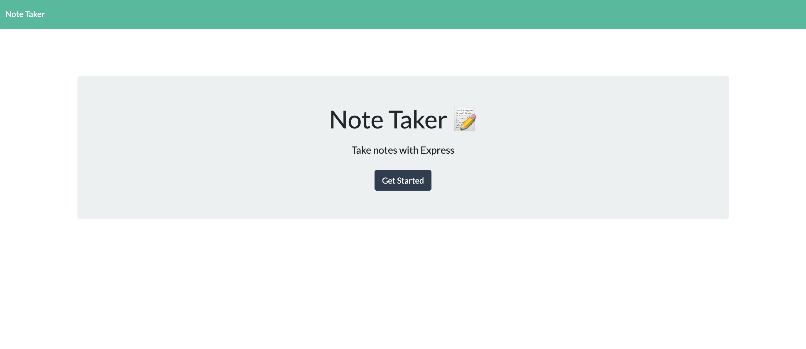
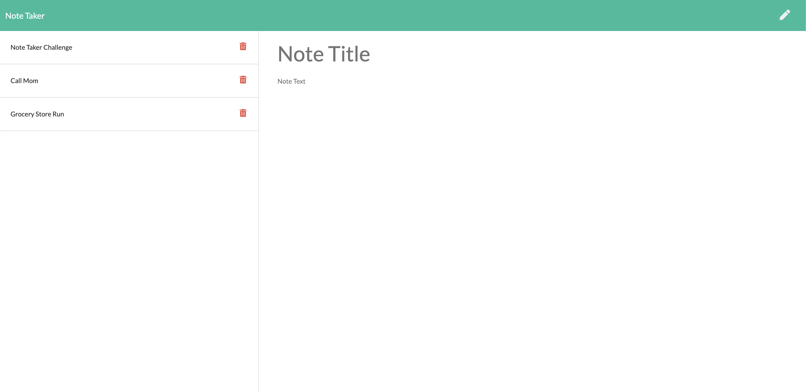
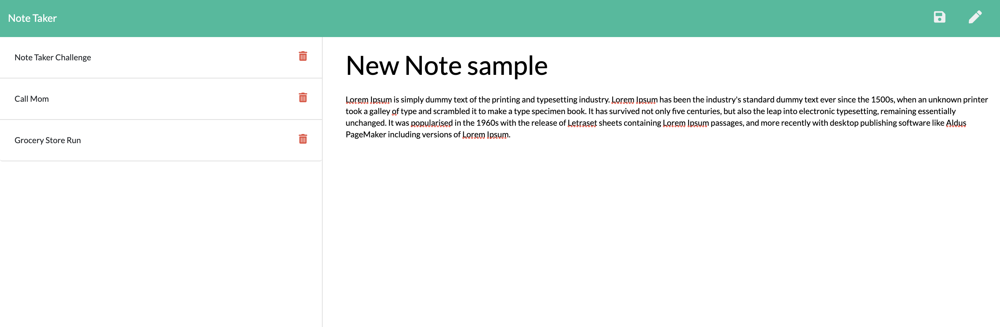

# Note Taker

## Description
Note Taker is a full stack deployed application. User has the ability to create a note title and text accordingly. Notes can be saved onto the application's database. 

## Table of Contents
* [Installation](#installation)
* [Usage](#usage)
* [License](#license)
* [Contribution](#contribution)
* [Test](#test)
* [Questions](#questions)

## Installation
Clone repository from (https://github.com/ginomaglaqueucla/note-taker-gm20.git) to local directory on computer.
1. Download/Obtain source code locally from GitHub Repository
2. Open terminal or gitbash command line, Change Directory (cd) to location of working directory
3. Enter `npm install`, to download dependicies
4. Enter `npm start`
5. Proceed to the following link [http://localhost:3001/](http://localhost:3001/)

## Usage
Proceed to the following link [https://agile-tundra-91035.herokuapp.com/](https://agile-tundra-91035.herokuapp.com/notes)
- Click Get Started button to procedd with Note Taking app
- To input new Note, click on pencil icon on the top right and proceed to fill in title/text
- To save Note, click the save icon on the top right, notice the newly created note on the left column
- To recall previous Note, click on desired note on left column

## License

MIT License

Copyright (c) [2020] [Gino Maglaque]

Permission is hereby granted, free of charge, to any person obtaining a copy of this software and associated documentation files (the "Software"), to deal in the Software without restriction, including without limitation the rights to use, copy, modify, merge, publish, distribute, sublicense, and/or sell copies of the Software, and to permit persons to whom the Software is furnished to do so, subject to the following conditions:

The above copyright notice and this permission notice shall be included in all copies or substantial portions of the Software.

## Contribution
This project uses the following external: 
- [Starter code](https://github.com/coding-boot-camp/miniature-eureka.git)
- heroku

To contribute to this project:
1. Clone repository from Installation section
2. Pull latest code locally, Create new working branch
3. Push up newly created branch
4. Create Pull Request and add reviewers when ready to merge with main code

## Test

## Questions
Any questions? Contact at: ginomaglaque@gmail.com

GitHub: [ginomaglaqueucla](https://github.com/ginomaglaqueucla)
